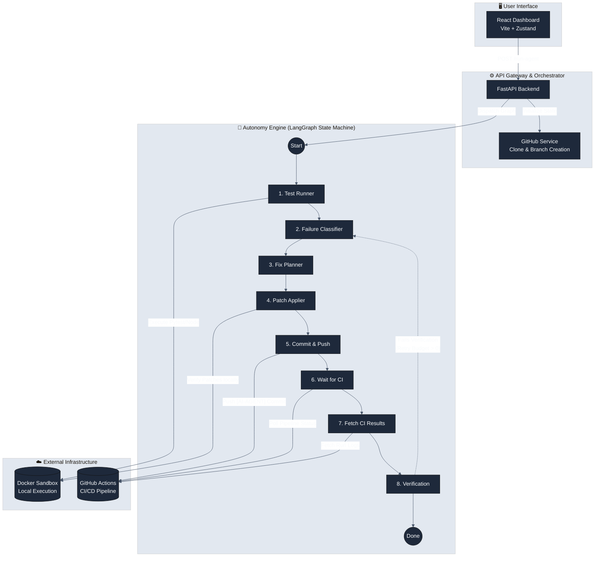

<div align="center">

# 🤖 Autonomous CI/CD Healing Agent

[](https://www.python.org/downloads/)
[](https://fastapi.tiangolo.com)
[](https://react.dev/)
[](https://www.docker.com/)
[](https://opensource.org/licenses/MIT)

**A deterministic, AI-driven Platform Engineering agent that automatically detects, classifies, and patches code failures in CI/CD pipelines.**

[](https://self-healing-frontend.onrender.com)

[Architecture](#-system-architecture) • [Quick Start](#-quick-start) • [Tech Stack](#-tech-stack)

</div>

---

## 📖 Overview

The **Autonomous CI/CD Healing Agent** is a full-stack AI DevOps system designed to catch breaking code changes, isolate the failure in a containerized sandbox, deduce the root cause using Large Language Models (LLMs), generate and test code patches locally, and push the resolved fixes back to the repository—all without human intervention.

Built using **LangGraph** for resilient, deterministic state management, the system limits hallucinations by combining static analysis (Regex) with AI reasoning, verifying everything locally via Docker before merging upstream.

### ✨ Key Features
* 🧠 **Deterministic Reasoning Loop**: Orchestrated via LangGraph with an 8-stage state machine (Test → Classify → Plan → Apply → Commit → Wait for CI → Fetch Results → Verify).
* 🛡️ **Execution Sandboxing**: Analyzes and executes generated fix patches in an isolated, secure Docker container before considering them resolved.
* 🔄 **Closed-Loop CI/CD Validation**: Seamlessly polls GitHub Actions APIs to ensure the applied fix passes upstream, iterating automatically if the pipeline still fails.
* 📊 **React-Powered Dashboard**: Modern Vite + React UI built with Zustand and Tailwind CSS, offering live progress, score breakdowns, timeline views, and diff summaries.
* 🎯 **Multi-Language Support**: Capable of detecting `SYNTAX`, `LOGIC`, `LINTING`, `TYPE_ERROR`, and `IMPORT` issues traversing Python, TypeScript, and Java.

---

## 🏗 System Architecture

The project architecture strictly separates the User Interface (React), the API Gateway (FastAPI), and the highly scalable Autonomy Engine (LangGraph).



---

## 💻 Tech Stack

* **Frontend:** React 19, Vite, TypeScript, Tailwind CSS v4, Zustand, Lucide React
* **Backend:** Python 3.11, FastAPI, Uvicorn, Pydantic, Python-dotenv
* **AI/Agent Framework:** LangGraph, Langchain Core, Google Gemini AI (via `httpx`)
* **Infrastructure:** Docker, Docker Compose, PyGithub

---

## 🚀 Quick Start

### 1️⃣ Prerequisites
To run this project locally, ensure you have the following installed:
* [Python 3.11+](https://www.python.org/downloads/)
* [Node.js 18+](https://nodejs.org/)
* [Docker Desktop](https://www.docker.com/products/docker-desktop/) (Must be running for the sandbox to function)

### 2️⃣ Environment Setup
Clone the repository and configure your secrets:

```bash
git clone https://github.com/YOUR_ORG/Automated_Self_Healing_System.git
cd Automated_Self_Healing_System

# Copy the example environment variables
cp .env.example .env
```

Edit the `.env` file and insert:
* `GITHUB_TOKEN`: A Personal Access Token (PAT) with `repo` and `workflow` scopes.
* `GEMINI_API_KEY`: A valid Google Gemini API key.

### 3️⃣ Running with Docker Compose (Recommended)
You can optionally spin up the entire cluster (Frontend, Backend, and Sandbox networks) using Docker Compose:

```bash
docker-compose up --build
```
* **Frontend Dashboard**: `http://localhost:80`
* **Backend API**: `http://localhost:8000`

### 4️⃣ Running Individually (Development Mode)

**Backend Server:**
```bash
cd backend
python -m venv venv
source venv/bin/activate  # On Windows: venv\Scripts\activate
pip install -r requirements.txt
uvicorn app.main:app --reload --port 8000
```

**Frontend Server:**
```bash
cd frontend
npm install
npm run dev
```

---

## 📂 Project Structure

```text
├── agents/                   # The AI Brain (LangGraph orchestrators & Tools)
│   ├── reasoning_loop.py     # Main LangGraph pipeline with conditional edges
│   ├── run_memory.py         # Append-only run/state persistence
│   ├── bug_classifier/       # Regex heuristic and fallback LLM classifier
│   └── tools/                # The 8 individual graph nodes
├── backend/                  # API Gateway (FastAPI)
│   ├── app/
│   │   ├── routes/           # REST endpoints
│   │   └── services/         # GitHub repository management
│   └── Dockerfile
├── frontend/                 # React UI Dashboard
│   ├── src/
│   │   ├── components/       # Visualizations, Timelines, Fix Tables
│   │   └── store/            # Zustand state management
│   └── package.json
├── sandbox/                  # Dockerized execution environment
│   └── Dockerfile
├── shared/                   # Schemas shared between services
└── docker-compose.yml        # Orchestration
```

---

## 📈 System Metrics & Scoring

The engine continuously evaluates its runs based on precision, speed, and iteration usage:

| Metric | Details |
|-----------|--------|
| **Base Score** | 100 points |
| **Speed Bonus** | +10 points if resolving the pipeline in under 5 minutes |
| **Commit Penalty** | −2 points per extra commit (Limits agent bloat) |
| **Max Cap Allowed** | 5 Iterations maximum per run to prevent infinite loops |

---

## ⚠️ Known Limitations

1. **GitHub Specificity**: The agent relies on the GitHub Actions API for pipeline verification. Other CI/CD providers (GitLab CI, CircleCI) are not currently supported.
2. **Container Prerequisite**: Code validation occurs strictly in Docker. The backend will error out if the Docker daemon config is missing or the Unix socket is inaccessible.
3. **In-Memory State**: Run state is currently stored in-memory (`store.py`). Refreshing the server during an active agent run will lose the session connection for the UI.

---

## 🤝 Contributing

Contributions, issues, and feature requests are welcome!
To contribute:
1. Fork the project.
2. Create your feature branch (`git checkout -b feature/AmazingFeature`).
3. Commit your changes (`git commit -m 'Add some AmazingFeature'`).
4. Push to the branch (`git push origin feature/AmazingFeature`).
5. Open a Pull Request.

## 📄 License
This project is licensed under the MIT License - see the [LICENSE](LICENSE) file for details.
